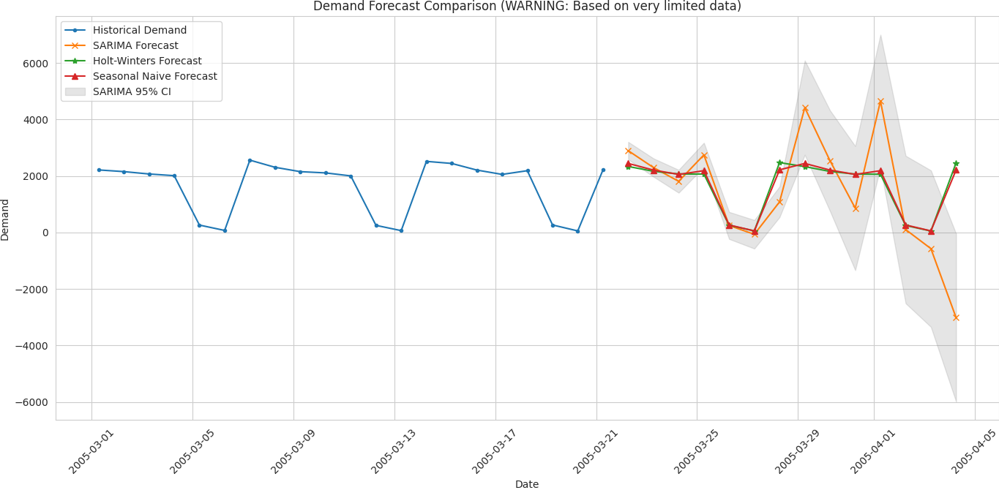

# Final Exam – BIA 5402

## Table of Contents

* [Final Exam – BIA 5402](#final-exam-bia-5402)
  * [Table of Contents](#table-of-contents)
  * [Case study 1](#case-study-1)
    * [Part A: Data Preparation & Exploration](#part-a-data-preparation--exploration)
        * [What kind of problems can arise if we do not handle missing time steps in time series data?](#what-kind-of-problems-can-arise-if-we-do-not-handle-missing-time-steps-in-time-series-data)
    * [Part B: Time Series Analysis](#part-b-time-series-analysis)
        * [Stationarity Check](#stationarity-check)
        * [Decompose the Series](#decompose-the-series)
    * [Part C: Forecasting Models](#part-c-forecasting-models)
    * [Part D: Model Evaluation & Business Recommendation](#part-d-model-evaluation--business-recommendation)
  * [Case study 2](#case-study-2)
    * [Part A: Data Exploration and Cleaning](#part-a-data-exploration-and-cleaning)
    * [Part B: Modeling Florence Book Purchase](#part-b-modeling-florence-book-purchase)

## Case study 1

### Part A: Data Preparation & Exploration

* The preprocessing code involved:

1. Reading the CSV.
2. Combining DATE and TIME columns.
3. Converting to datetime objects.
4. Aggregating demand by date (summing DEMAND, taking the minimum TIME).
5. Creating a final datetime index.
6. Selecting the relevant DEMAND column.

* This process below used for preprocessing and visualize the data

[preprocess script](./scripts/preprocess.py)

* This is image for visualizing demand over time

* Comment

1. Trend: Over the short period shown (approx. 3 weeks), there isn't a clear, consistent overall upward or downward trend. Demand decreases in the first few days and then fluctuates.
2. Seasonality: The data covers only 3 weeks, which is insufficient to confirm true seasonality. However, there's a noticeable pattern of sharp drops around March 5th, 12th, and 19th (Saturdays). This strongly suggests a potential weekly pattern (lower demand on weekends), but more data would be needed for confirmation.
3. Irregularity: The series exhibits significant fluctuations (volatility). The most prominent irregularities are the sharp drops suspected to be linked to weekends. Day-to-day demand varies considerably otherwise.

#### What kind of problems can arise if we do not handle missing time steps in time series data?

* Incorrect Calculations: Breaks the assumption of regular intervals, leading to errors in calculating lags, rolling statistics, and correlations (ACF/PACF).
* Inaccurate Models & Forecasts: Standard time series models (like ARIMA) expect regular data, so gaps lead to biased parameters and unreliable predictions.
* Misleading Visuals: Plots can distort time, hiding gaps and suggesting incorrect trends or patterns.
* Tool/Function Errors: Many standard time series analysis tools may fail or produce wrong results if data intervals aren't consistent.

#### How would differencing help here, and how do you detect the correct level of differencing needed?

1. How Differencing Helps

* Differencing is primarily used to make a time series stationary, which is a requirement for many time series models like ARIMA. A stationary series has statistical properties (like mean, variance, autocorrelation) that are constant over time.   

* Specifically, differencing helps by:

    * Removing Trends: Subtracting consecutive observations (first difference, `Y_t - Y_{t-1}`) typically removes a linear trend, stabilizing the mean of the series. If a series has a quadratic trend, a second difference `((Y_t - Y_{t-1}) - (Y_{t-1} - Y_{t-2}))` might be needed, but this is less common.

    * Removing Seasonality: Subtracting observations from the previous season (seasonal difference, e.g., `Y_t - Y_{t-S}` where S is the seasonal period like 7 for weekly) can remove repeating seasonal patterns.

* It's important to note that differencing does not directly solve the problem of missing time steps. Missing data needs to be handled first (e.g., by filling gaps or using models that can handle them). Differencing is usually applied after ensuring the time series has a complete, regular index, to prepare it for modeling by achieving stationarity.   

### Part B: Time Series Analysis

#### Stationarity Check

[Stationarity check python code script](./scripts/stationarity.py)

* Augmented Dickey-Fuller (ADF) Test result:

    * 

    * Interpretation: Since the p-value (0.786) is much greater than the common significance level of 0.05, we fail to reject the null hypothesis. This indicates that the time series is likely non-stationary.

[Deviation code script](./scripts/deviation.py)

* Rolling Mean and Standard Deviation Plot:

    * 

    * Comment: The plot clearly shows that the rolling mean (red line) is not constant; it exhibits noticeable downward and upward movements over time. The rolling standard deviation (black line) also varies significantly, particularly spiking during the sharp drops in demand. This visual evidence supports the ADF test result, confirming that the series is non-stationary as its statistical properties change1 over time.   

#### Decompose the Series

[Decompose code script](./scripts/decompose.py)

* Result: 

    * 

* Seasonal Decomposition Plot:

    * Components: The plot successfully breaks down the original time series into:
        * Trend: Shows the underlying long-term movement (initially downward, then slightly recovering).
        * Seasonal: Clearly reveals a repeating pattern within a 7-day cycle, capturing the sharp dips observed earlier.
        * Residual: Represents the random noise or irregularities remaining after removing the trend and seasonal components.

* Type of Seasonality Observed:

    * The decomposition was performed assuming a period of 7 days, based on the visual pattern in the original data. The resulting 'Seasonal' component plot confirms a strong, repeating pattern that aligns with this 7-day cycle.
    * Therefore, the seasonality observed in this data is weekly.

### Part C: Forecasting Models

* [Forecasting code script](./scripts/train.py)

* Result: 

*  The choice of `(1, 1, 0)(1, 1, 0)7` was a heuristic (best guess) based on the limited analysis possible and aimed for simplicity for demonstration

    * s=7 (Seasonal Period): This was clearly indicated by the visual inspection of the data and the seasonal decomposition, showing a strong weekly pattern.
    * d=1 (Non-seasonal Differencing): The ADF test on the original 21 points indicated the series was likely non-stationary (p > 0.05). First-order differencing (d=1) is the standard first step to address non-stationarity (like a trend or changing level).
    * D=1 (Seasonal Differencing): The weekly pattern was very strong and consistent. Applying one order of seasonal differencing (D=1) is the standard approach to remove such strong, stable seasonality.
    * p=1, q=0 (Non-seasonal AR/MA): After applying both non-seasonal (d=1) and seasonal (D=1) differencing, very few data points remain to analyze reliably via ACF/PACF. Choosing p=1 assumes there might be some correlation left with the immediately preceding value after differencing. Setting q=0 keeps the model as simple as possible (an AR(1) structure for the non-seasonal part).
    * P=1, Q=0 (Seasonal AR/MA): Similar to the non-seasonal part, analyzing ACF/PACF at seasonal lags (7, 14...) after differencing is unreliable. Choosing P=1 assumes some correlation might remain with the value from the previous season (lag 7) after differencing. Setting Q=0 again keeps the seasonal part as simple as possible (a seasonal AR(1) structure).

### Part D: Model Evaluation & Business Recommendation

* [Evaluation Metrics code script](./scripts/update.py)

* Result:

| Model         |    MAE |       MSE |   RMSE |
|:--------------|-------:|----------:|-------:|
| SARIMA        | 455.37 | 215002.56 | 463.68 |
| HoltWinters   | 138.76 |  36540.40 | 191.16 |
| SeasonalNaive | 126.75 |  30888.25 | 175.75 |

* Model Performance Comparison

    * Based purely on these metrics calculated on the tiny 4-point test set, the Seasonal Naive model yielded the lowest error (MAE, MSE, RMSE), followed closely by Holt-Winters. The SARIMA model performed significantly worse, likely due to instability from fitting on insufficient training data
    * Crucial Caveat: This comparison has very low reliability. Evaluating models on only 4 data points doesn't provide a statistically meaningful assessment of their true predictive power. The Seasonal Naive method might appear best simply because the more complex models didn't have enough data to learn properly

* Business Recommendation

    * Based on this analysis of extremely limited historical data (only 3 weeks), it is strongly recommended not to use these forecasts to make decisions about increasing or decreasing production next month. The dataset is far too small to build reliable predictive models, as evidenced by the instability of SARIMA and the unreliable evaluation metrics. Therefore, confidence in any prediction derived from this analysis is extremely low (effectively zero). The most critical next step is to gather significantly more historical demand data (ideally 1-2 years or more) before attempting to build a trustworthy forecasting model. Until then, production planning may need to rely on simpler methods, recent actuals, or qualitative business judgment while prioritizing data collection efforts.

* Based on the analysis performed with the very limited dataset (only 21 days of data), Confidence in the predictions is extremely low, effectively zero. Therefore, any forecast generated from this specific analysis should not be considered reliable for decision-making

* Residuals:

    * What they are: Think of residuals as the forecast errors. After we make a prediction (e.g., forecast 1000 units sold) and then see what actually happened (e.g., 1050 units sold), the difference (in this case, 50 units) is the residual for that period.
    * Why we look at them: We examine the pattern of these errors over time. Ideally, the errors should look random – sometimes we're a bit high, sometimes a bit low, with no clear pattern. If the errors do show a pattern (like we consistently forecast too low on Mondays), it tells us our model missed something important, and we might be able to improve it. Random errors generally mean the model captured the predictable patterns well.
* Confidence Intervals:

    * What they are: Since no forecast is ever perfect, a confidence interval provides a range around our main forecast number, giving a sense of how certain we are. Instead of just saying "we predict 1000 units next week," we might provide a 95% confidence interval, saying "we're 95% confident that sales will be between 900 and 1100 units."
    * Why they matter: They show the level of uncertainty in the forecast. A narrow range (like 980-1020) suggests high confidence. A very wide range (like 500-1500) signals low confidence and means the actual result could be very different from the main forecast number. It helps you understand the potential variability and risk associated with the prediction.

* Limitations of the Forecast:

    * Extreme Data Scarcity: This is the most critical limitation. The forecast is based on only 21 days of historical data. This is insufficient to reliably identify underlying patterns (like trend and seasonality), train complex models (like SARIMA or Holt-Winters), or validate performance.
    * High Uncertainty: Due to the lack of data, the confidence in the forecast is extremely low. The models might be overfitting to noise or missing the real patterns entirely. The wide confidence interval seen with the SARIMA forecast visually represents this uncertainty.
    * Model Instability: Complex models like SARIMA demonstrated instability (e.g., predicting negative demand), indicating they couldn't be reliably fitted to the sparse data.
    * Assumption of Past Patterns Continuing: The forecast assumes that the limited patterns observed in those specific 3 weeks of March 2005 will continue exactly into the future, which is a very strong and likely incorrect assumption.
    * Exclusion of External Factors: These forecasts are based only on past demand values. They inherently do not account for any external events or changes that could influence demand.
* How External Factors Might Affect It:

    * Because the forecast relies solely on historical demand patterns, various external factors could cause actual demand to deviate significantly from the predicted values. These include:

    * Marketing and Promotions: Any new advertising campaigns, discounts, or special offers for the product (or competing products) launched during the forecast period would directly impact sales in ways the model doesn't account for.
    * Competitor Actions: Price changes, new product launches, or promotions by competitors could draw customers away or increase overall market activity.
    * Weather: Demand for soft drinks can be sensitive to weather. Unusually hot or cold weather during the forecast period (the two weeks following March 21st, 2005) compared to the historical period would likely change consumption patterns.
    * Holidays or Special Events: Any local holidays, festivals, or major events occurring during the forecast period could temporarily boost or alter demand patterns.
    * Economic Factors: While less likely to change drastically in two weeks, sudden shifts in local economic conditions or consumer confidence could have an effect.
    * Supply Chain Disruptions: Issues like stockouts at key retailers, although technically a supply issue, would manifest as lower measured demand than forecasted.

## Case study 2

### Part A: Data Exploration and Cleaning

* Target Variable: I created a new column Florence_Buyer where 1 indicates the customer bought the Florence travel book and 0 indicates they did not. This simplifies the analysis.

* Overall Purchase Patterns:

    * Across all customers, the most frequently purchased genres are Cook Books (CookBks), Children's Books (ChildBks), and Geography Books (GeogBks).
    * The average number of books purchased per customer is highest for CookBks (0.73) and ChildBks (0.64).
    * Italian-themed books like ItalAtlas and ItalArt have the lowest average purchases (0.04 and 0.05, respectively).
Purchase Patterns by Florence Buyer Status:

    * Customers who purchased the Florence travel book (Florence_Buyer = 1) generally buy slightly more books across most genres compared to those who didn't (Florence_Buyer = 0).
    * The most notable differences are in Art Books (ArtBks), Geography Books (GeogBks), Reference Books (RefBks), Do-It-Yourself Books (DoItYBks), and Youth Books (YouthBks), where Florence buyers purchase noticeably more on average.
    * For instance, Florence buyers purchase an average of 0.52 Art Books compared to 0.27 for non-buyers, and 0.57 Geography Books compared to 0.37 for non-buyers.
    * Purchases of Italian-themed books (ItalCook, ItalAtlas, ItalArt) are also slightly higher among Florence buyers, though the overall purchase rates for these genres remain low.

* [Remove Columns Script](./scripts/remove_columns.py)

* [Random Forest model](./scripts/randomforestmodel.py)

* Result: 

### Part B: Modeling Florence Book Purchase

* [Classification moded script](./scripts/classification_model.py)

* Result: 

* Key Drivers of Customer Behavior (Influencing Florence Book Purchase):

* Based on the Random Forest model, the most important factors are:

    * M (Monetary): Total amount spent by the customer. This was the strongest predictor.
    * FirstPurch: Months since the customer's first purchase (indicating customer tenure).
    * R (Recency): Months since the customer's last purchase.
    * F (Frequency): Total number of purchases made.
    * Related Purchase: Number of related books purchased.

* Interpretation:

    * The model suggests that established, high-spending customers who purchase frequently and recently are the most likely to buy the specialty Florence travel guide. General purchasing habits (RFM metrics and customer tenure) are more influential than purchases within specific genres like Art or Geography, even though we initially observed some correlation there. Italian-themed books had minimal predictive impact according to the model

* Final

    * Ensemble methods, like the Random Forest we used, often outperform simpler models like Logistic Regression for several reasons, particularly in contexts like customer behavior analysis:   

        * Capturing Non-Linear Relationships: Logistic Regression assumes a linear relationship between the features and the log-odds of the target variable (buying the Florence book). Customer behavior is rarely strictly linear. For example, the impact of total spending (M) might increase sharply initially but then level off, or the effect of purchase recency (R) might be non-linear. Random Forests, being based on decision trees, can naturally capture these complex, non-linear patterns without needing features to be transformed first.   

        * Handling Feature Interactions: The effect of one feature might depend on the value of another. For instance, high purchase frequency (F) might be a strong predictor only if combined with high monetary value (M). Random Forests automatically consider these interactions as they build trees and split nodes based on different features at different levels. In Logistic Regression, you would typically need to manually create interaction terms (e.g., F * M) to capture these effects.   

        * Robustness to Outliers: Random Forests are generally less sensitive to outliers than Logistic Regression because decision tree splits are based on partitioning the data rather than fitting a specific linear equation influenced by extreme values.

        * Reduced Variance: A single decision tree can be prone to overfitting (high variance). Random Forest reduces this variance by building many trees on different subsets of the data and features, then averaging their predictions. This typically leads to a more robust and generalizable model.   

        * No Need for Feature Scaling: Tree-based methods like Random Forest are not sensitive to the scale of features, whereas Logistic Regression often requires features to be scaled (e.g., standardized) for optimal performance, especially when regularization is used.   

    * While Logistic Regression is simpler and its coefficients are easier to interpret directly, the ability of ensemble methods like Random Forest to model complex, non-linear patterns and feature interactions often gives them an advantage in predictive accuracy for datasets exhibiting these characteristics, which is common in customer purchasing data.

* Apriori script
    * [Script](./scripts/apriori.py)

* Result: 

* Preview top 3 rules and provide actionable insights result by script : 
